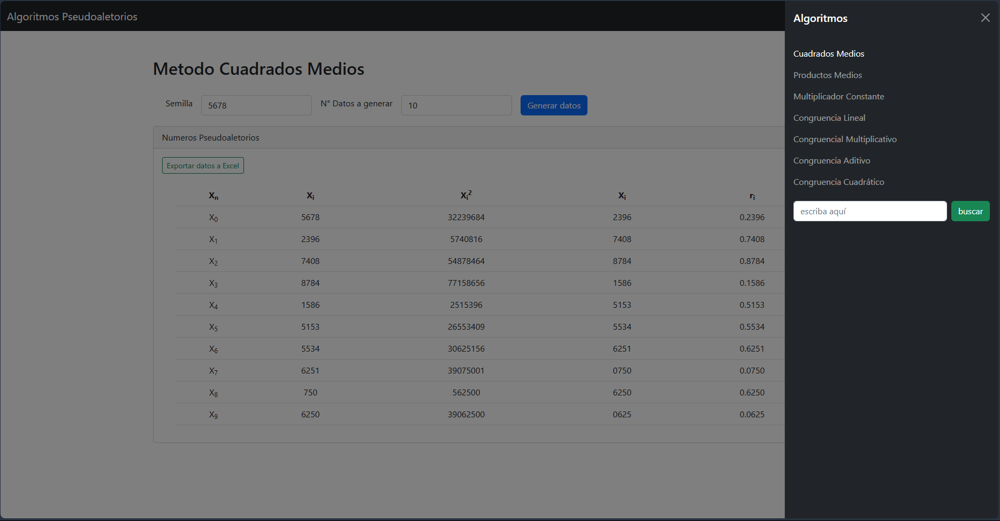

# Algoritmos Pseudoaleatorios 
Los algoritmos Pseudoaletorios utilizados en este repositorio se basan en el libro: 
* Simulacion y análisis de sistemas 2da edicion (Capítulo 2) 

## Menú 
Para acceder a cada método accede a la barra de navegación desplazadora de la esquina superior derecha. Contiene el listado de los algoritmos que se hablarán a continuación.

## Cuadrados Medios

Este algoritmo no congruencial fue propuesto en la década de los cuarenta del siglo xx por Von Neumann y Metrópolis.

Requiere un número entero detonador (llamado semilla) con D dígitos, el cual es elevado al cuadrado para seleccionar del resultado los D dígitos del centro; el primer número r¡ se determina simplemente anteponiendo el "0." a esos dígitos.  

### Proceso 

1. Seleccionar una semilla (X0) con D dígitos (D > 3).
2. Sea Y0 = resultado de elevar X0 al cuadrado; sea Xi = los D dígitos del centro, y sea r¡ = "0.D" dígitos del centro.
3. Sea Yi= resultado de elevar X al cuadrado; sea Xi+1 = los D dígitos del centro, y sea ri = "0.D" dígitos del centro para toda i = 1, 2,3 ,... n.
4. Repetir el paso 3 hasta obtener los n números ri deseados. (sin embargo es opcional ingresar n)

Nota: Si no es posible obtener los D dígitos del centro del número Yi agregamos ceros a la izquierda del número Yi.

[`código javaScript`](JS/cuadradosMedios.js), [`Archivo html`](menu.html)

## Algoritmo de Productos Medios
Este es un algoritmo no congruencial que, al igual que el de cuadrados medios, también fue propuesto en la década de los 40. La diferencia clave es que requiere **dos semillas** en lugar de una, ambas con el mismo número de dígitos (**D**). 

El proceso consiste en multiplicar estas dos semillas y extraer los **D** dígitos centrales del producto. Luego, la secuencia continúa multiplicando la semilla más reciente con el número generado previamente.

### Proceso
1. Seleccionar dos semillas (X_0) y (X_1), ambas con **D** dígitos.
2. Multiplicar las semillas (X_0 * X_1), obteniendo (Y_0), del cual se extraen los **D** dígitos del centro para formar el primer número pseudoaleatorio (r_1).
3. En cada paso posterior, la semilla más antigua se reemplaza, y se multiplica la semilla más reciente con el número generado en el paso anterior.
4. Repetir este proceso hasta obtener los **n** números deseados.

[`código javaScript`](JS/productosMedios.js), [`Archivo html`](index3.html)

## Algoritmo de Multiplicador Constante
Este algoritmo no congruencial se basa en multiplicar una semilla por una constante, ambas con **D** dígitos, y extraer los dígitos centrales del producto.

### Proceso
1. Seleccionar una semilla (X_0) con **D** dígitos.
2. Elegir una constante (a), también con **D** dígitos.
3. Multiplicar la semilla por la constante, extraer los **D** dígitos centrales del producto, y anteponer un “0.” para obtener el primer número pseudoaleatorio (r_1).
4. Repetir el proceso con el nuevo valor (X_1) obtenido.

<!-- descripción del proceso -->
[`código javaScript`](JS/multiplicadorConstante.js), [`Archivo html`](index4.html)

## Algoritmo de Congruencia Lineal
El algoritmo congruencial lineal es uno de los más utilizados para la generación de números pseudoaleatorios y sigue la fórmula recursiva:

* X_{i+1} = (aX_i + c) mod m

Donde (X_0) es la semilla, (a) es la constante multiplicativa, (c) es la constante aditiva, y (m) es el módulo.

### Proceso
1. Seleccionar los parámetros: semilla (X_0), constantes (k), y (g).
2. Calculamos los parámetros: Modulo (m), constantes (a), (c) y (n) mediante los valores anteriores y sus respectivas fórmulas. (visibles en la tabla) 
3. Calcular el siguiente número pseudoaleatorio usando la ecuación recursiva.
4. Normalizar el valor dividiendo entre (m-1).

[`código javaScript`](JS/congruenciaLineal.js), [`Archivo html`](index5.html)

## Algoritmo Congruencial Multiplicativo
Este algoritmo es una variante del anterior, con la diferencia de que no hay constante aditiva ((c = 0)).

### Proceso
1. Seleccionar una semilla (X_0), las constantes (k), y un módulo (g).
2. Calcular el siguiente número pseudoaleatorio mediante la ecuación:
* X_{i+1} = (aX_i) mod m
3. Normalizamos el valor dividiendo entre (m-1)

[`código javaScript`](JS/congruencialMultiplicativo.js), [`Archivo html`](index6.html)

## Algoritmo Congruencial Aditivo
Este algoritmo genera números a partir de una secuencia inicial de enteros y suma dos de ellos para generar el siguiente número.

### Proceso
1. Definir una secuencia inicial de números (X_1, X_2, ... , X_n).

2. Ingresar los valores de Módulo (**m**) e Cantidad de datos (**n**). 
3. Generar el siguiente número pseudoaleatorio mediante la ecuación:

* X_{i} = (X_{i-n} + X_{i-1}) mod m

[`código javaScript`](JS/congruencialAditivo.js), [`Archivo html`](index.html)

## Algoritmo Congruencial Cuadrático
Es una versión no lineal del algoritmo congruencial lineal, donde la fórmula es:
* X_{i+1} = (aX_i^2 + bX_i + c) mod m

### Proceso
1. Definir los parámetros: Semilla (x_0),  (g), (a), (b) y (c).
2. Calcular los números pseudoaleatorios mediante la fórmula cuadrática.

[`código javaScript`](JS/congruencialCuadratico.js), [`Archivo html`](index7.html)

---
### Requisitos para su uso
* Conexión a internet: se hace uso de framework Boostrap 5. 